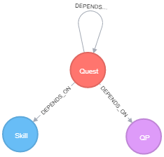

# Runescape Quest Dependency Graph

TODO: Update overview..

## Getting Started

1. Spin up a clean Neo4j instance.
2. Run the following cypher to add constraints on Neo4j (to help py2neo)
3. Install py2neo from pip
4. Run `python import-skills.py`
5. Run `python import-quests.py`

## Schema

After performing the above steps, we can view the schema with `CALL db.schema()`. This will returns the following schema.

  

### Thanks

* Powered by Cypher, Neo4j, and py2neo 

## Contributing

Feel free to use, extend, and tailor one for needs.

If you have pointers, new ideas, branch out and create a PR.

If you have any questions, message me or throw something in the issues.